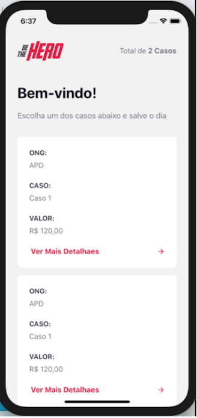

<div align="center">
    
    <p><strong>Projeto desenvolvido durante a semana omnistack 11</strong></p>
    <p>Site: <a href="https://bethehero-front.netlify.com/">Be The Hero</a></p>
    
    
</div>


<p align="center">
  
</p>


# semanaomnistack11
<p align="center">
  
  
</p>

<p align="center">

</p>

---
- #reactjs 
- #reactnative 
- #nodejs

# Metodos HTTP
---
GET:    buscar uma informacao do back-end; </p>
POST:   criar uma informacao no back-end; </p>
DELETE: deletar uma informacao no back-end; </p>
PUT:    alterar uma informacao no back-end; </p>


# Sobre
---
A aplicação desenvolvida tem o objetivo de ajudar ONGs que podem cadastrar novos casos no site, deste modo as pessoas podem contribuir com o valor de cada caso através do aplicativo.

# Instalação
---
Backend - Frontend - Mobile
Digite: npm install dentro da pasta backend, frontend e mobile

# Tutorial para criação do Projeto BackEnd NodeJS
---
``` 
npm init -y 
```

Instalando Programas para analisar as rotas criadas </p>

[insomnia](https://insomnia.rest/download/)

---
Instalando dependencias </p>

* npm install express </p>
* npm install nodemon -D  </p>

</p></p>
alterar o arquivo package.json

incluir

``` 
"scripts":{
   "start": "nodemon ./src/index.js"
}, 
```

---------------------------------------------------
instalar para trabalhar com banco SQL - "utilizando sqlite" </p>

* npm install knex </p>
* npm install sqlite </p>

iniciar o knex </p>

* npx knex init  </p>

vai gerar um arquivo chamado knexfile.js, deve colocar o endereco onde ficará o banco de dados.
Exemplo:

``` json

module.exports = {
  development: {

    client: "sqlite3",
    connection: {
      filename: "./src/database/db.sqlite"
    },
    migrations: {
      directory: "./src/database/migrations"
    },
    useNullAsDefault: true

  }, 

```

  Criar as pastas em src => database e migrations
  para criar as migrates

* npx knex migrate: make create_nomeTabela

Ao rodar o comando acima, vai gerar um arquivo, onde vai aparecer o sequinte schema

* aqui vai criar os campos da tabela

xports.up = function(knex) {
}

* caso queira da hollback deve colocar aqui

exports.down = function(knex) {
}

A estrutura vai ficar parecida com isso
exports.up = function(knex) {
  return knex.schema.createTable("ongs", function(table) {

    table.string("id").primary();
    table.string("name").notNullable();
    table.string("email").notNullable();
    table.string("whatsapp").notNullable();
    table.string("city").notNullable();
    table.string("uf", 2).notNullable();

  }); 
}; 

exports.down = function(knex) {
  return knex.schema.dropTable("ongs"); 
}; 
-------------------------------------------------------------------------

para criar tabela 
npx knex migrate: latest

